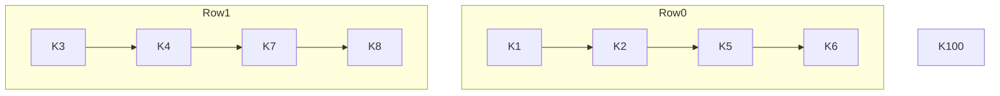
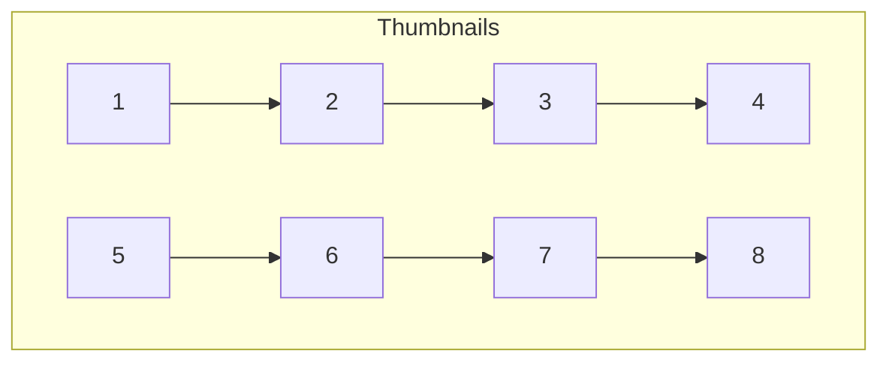

# Kartoteka

## Overview
A small tkinter application for organizing Pokémon card scans and exporting data to CSV.

## Features
- Load images from a folder and review them one by one
- Fetch card prices from a local database (`card_prices.csv`)
- Automatically query the TCGGO API when a price is missing
- Cardmarket price is calculated as the average of the 30-day average and trend
  price when both metrics are available, falling back to the lowest near-mint
  price otherwise
- Display card images when available, falling back to `image`, `imageUrl` or `image_url` if `images.large` is not provided
- Prices for "Holo" or "Reverse" variants are calculated by multiplying the base price by **3.5**
- View alternative API results via the **Inne warianty** button
- Convert API prices from EUR to PLN using a 1.23 multiplier rounded to two decimals
- Save collected data to a CSV file
- Autocomplete set selection (press <kbd>Tab</kbd> to accept a suggestion)
- Toggle the **Reverse** switch on the pricing screen when pricing a reverse card
- Import CSV files and merge duplicates automatically
- Show warehouse occupancy with dedicated icons for standard boxes and optionally for K100 when `box100.png` is available
- Display warehouse cards as rows of thumbnails, grey out sold items and move them to the end
- Toggle a sold flag to exclude cards from occupancy statistics
- Automatically updates the list of card sets and downloads new logos on startup

## Requirements
Install dependencies from `requirements.txt`:

```bash
pip install -r requirements.txt
```

`zlib` comes bundled with Python's standard library and does not need to be
installed separately.  On Linux, the `opencv-python` wheel requires the
`libgl1` and `libglib2.0-0` system packages.  Install them with:

```bash
sudo apt-get update && sudo apt-get install -y libgl1 libglib2.0-0
```

If your version of `ttkbootstrap` is 1.10 or newer, the buttons will display built-in icons.
On older versions the icons are skipped automatically.

Ensure a `card_prices.csv` file with columns `name`, `number`, `set` and `price` exists in the project directory.

## Fingerprint Database

The application can maintain a tiny SQLite database of image fingerprints to
recognise duplicate scans. Each entry stores perceptual hashes and optional
ORB descriptors together with card metadata, allowing previously processed
images to be matched quickly.

Set the `HASH_DB_FILE` environment variable to a writable SQLite file to enable
persistent storage. The file is created automatically if it does not exist.
When it is not provided the fingerprint database is disabled and no duplicate
detection is performed.

During a scan the application initialises :class:`HashDB` with this file so
fingerprints are written to disk rather than a transient in-memory database.  A
new entry is stored via ``add_card_from_fp`` for every card that is processed
and the information is reused on subsequent scans to recognise cards
automatically. Identical fingerprints are ignored, preventing accidental
duplicate rows.

### Dependencies

Fingerprinting relies on [`numpy`](https://numpy.org), [`Pillow`](https://python-pillow.org) and
[`imagehash`](https://github.com/JohannesBuchner/imagehash). When
[`opencv-python`](https://pypi.org/project/opencv-python/) is installed, ORB
features are generated for more accurate comparisons. The database itself uses
Python's built-in `sqlite3` module.

### Hash generation and storage

`fingerprint.compute_fingerprint` normalises each image and computes a global
perceptual hash, a difference hash and a grid of tiled pHashes. The resulting
arrays (and optional ORB descriptors) are serialised to base64 strings with
`fingerprint.pack_ndarray` and stored in the `cards` table of the fingerprint
database alongside a JSON `meta` column.

### Duplicate detection during scan

When a new scan is loaded its fingerprint is compared against existing records.
Distances are calculated by summing Hamming distances of the stored hashes and
subtracting the number of ORB matches. A low score indicates the scan already
exists in the database and can be flagged as a duplicate.

### Examples

Initialise a database and store a fingerprint:

```bash
python - <<'PY'
from hash_db import HashDB
db = HashDB('hashes.sqlite')
db.add_card_from_image('scan.png', meta={'name': 'Sample'})
PY
```

Run the fingerprint tests:

```bash
pytest tests/test_fingerprint_db.py
```

## Configuration (.env variables)
Create a `.env` file with API credentials and optional FTP settings:

```bash
RAPIDAPI_KEY=your-key-here
RAPIDAPI_HOST=pokemon-tcg-api.p.rapidapi.com
SHOPER_API_URL=https://your-store.shop/webapi/rest
SHOPER_API_TOKEN=your-token
OPENAI_API_KEY=sk-...
FTP_HOST=example.com
FTP_USER=username
FTP_PASSWORD=secret
WAREHOUSE_CSV=magazyn.csv
BASE_IMAGE_URL=https://your-store.shop/upload/images
HASH_DB_FILE=hashes.sqlite
```

- `OPENAI_API_KEY` – API key used by OpenAI Vision to extract card details from scans.
- `HASH_DB_FILE` – path to a writable SQLite file used for fingerprint storage.
  The application stores fingerprints in this file on each scan and reuses it across sessions for automatic card recognition. When unset duplicate detection is disabled.

**Warning:** This file may contain private API keys and tokens. It is excluded
from version control via `.gitignore` and should never be shared publicly.

The `RAPIDAPI_*` variables are used when a card price is not found in the local database. `SHOPER_API_URL` and `SHOPER_API_TOKEN` configure access to your Shoper store for the **Porządkuj** window. The application expects the `/webapi/rest` endpoint and will append it automatically if it is missing. `FTP_HOST`, `FTP_USER` and `FTP_PASSWORD` configure optional FTP uploads. `OPENAI_API_KEY` supplies the key for OpenAI Vision to recognise card details from scans. `BASE_IMAGE_URL` should point to the public directory where scans are uploaded so OpenAI can fetch them during analysis and the exported CSV contains correct links. Leading or trailing spaces in `SHOPER_API_URL` and `SHOPER_API_TOKEN` are ignored.
`WAREHOUSE_CSV` controls where the local warehouse CSV is written.

## Warehouse Layout
The warehouse view arranges eight standard boxes in two rows followed by a special overflow box:



Each standard box has four columns of 1,000 slots. Box `K100` is a dedicated overflow container with a single column and 500 slots. If a `box100.png` file is present it is used as a distinct icon.

### Row-based thumbnails
Cards stored in the warehouse are displayed as thumbnails in rows of four. Sold items are greyed out and listed after available cards.



### Sold-card handling
* Use **Mark as sold** from the card details window to toggle status.
* Cards flagged as sold (`1`, `true` or `yes`) are excluded from capacity statistics.
* Sold entries appear with a `[SOLD]` prefix and grey text.

### CSV fields
The warehouse CSV uses the following columns: `name`, `number`, `set`, `warehouse_code`, `price`, `image` and `sold`.

### Layout configuration constants
Adjust the layout in `kartoteka/ui.py` via central constants. They replace
previously scattered magic numbers for thumbnail sizes, grid columns, and box
capacities, making future tweaks much simpler.

- `GRID_COLUMNS` – number of columns per box (default **4**)
- `BOX_COLUMN_CAPACITY` – slots per column (default **1000**)
- `BOX_COUNT` – number of standard boxes (default **8**)
- `SPECIAL_BOX_NUMBER` – overflow box identifier (default **100**)
- `SPECIAL_BOX_CAPACITY` – slots in the overflow box (default **500**)
- `BOX_THUMB_SIZE` – pixel size of box thumbnails
- `CARD_THUMB_SIZE` – pixel size of card thumbnails
- `BOX_CAPACITY` – total slots per standard box (`GRID_COLUMNS * BOX_COLUMN_CAPACITY`)

## Running the App
Execute the main script with Python 3:

```bash
python main.py
```

The interface will allow you to load scans, fetch prices from the local database
or the API, and export results to CSV.  Use the **Skanuj** button to reveal a
panel for entering the starting box, column and position.  After clicking
**Dalej** and selecting a folder of images the application loads the scans
starting from the specified location.

## Running Tests
The automated tests are written with `pytest` and mock out all GUI components,
so they can run headlessly.

Install the dependencies and execute the suite with:

```bash
pip install -r requirements.txt
pytest
```

### Cheatsheet
Press the **Ściąga** button on the editor window to open a scrollable cheat sheet with the names and codes of all card sets. When set symbols are available they are displayed alongside the entries.

The application now fetches missing set symbols automatically on startup. If you need to refresh them manually run:

```bash
python download_set_logos.py
```

This creates a `set_logos/` directory that should stay next to `main.py` so the cheatsheet can load the images.

### Importing CSV files
Use the **Import CSV** button on the welcome screen to merge an existing CSV file. Rows that share the `nazwa`, `numer` and `set` columns are combined and their quantity summed. The importer recognises quantity columns named `stock`, `ilość`, `ilosc`, `quantity` or `qty` (case and spacing are ignored). If no such column is found, the merged output adds an `ilość` column with the calculated totals. The importer accepts both `image1` and the legacy `images 1` column when loading existing files. All unique `warehouse_code` values from the merged rows are preserved and joined with semicolons so you can still locate every individual card after deduplication.

### Cache
Every time you press **Zapisz i dalej**, the entered values are stored in a temporary cache under a key composed of `name|number|set`. When another scan of the same card is loaded, the application pre-fills the form with the cached data so you do not need to type them again.

### Shoper integration
Use the **Porządkuj** button to open a window with actions against your Shoper store. The interface now focuses on displaying new orders. Each order item is matched with the `warehouse_code` so you can quickly locate it in storage. Make sure the Shoper credentials are set in `.env` before launching the application.

### Dashboard
The welcome screen displays a small dashboard with store statistics fetched from your Shoper account: counts of new orders, pending shipments or payments and recent sales totals. To populate these fields the token must have permissions to read orders and statistics. Active product count is taken from the sales statistics when available, otherwise the application queries the inventory to determine the total number of products. Use the **Pokaż szczegóły** button to open the Shoper window with the order list.

### Product attributes
When a card is sent to Shoper the application also posts a `Typ` attribute for the new product. The attribute ID is looked up using `GET /attributes` on first use and cached for later calls. The value is built from all enabled type checkboxes (`Common`, `Holo`, `Reverse`).

### Inventory CSV format
The auction queue reads cards from `magazyn.csv`. Preferred headers are
`nazwa_karty`, `numer_karty`, `cena_początkowa`, `psa10_price`, `kwota_przebicia` and
`czas_trwania`. When these columns are missing the loader also accepts a Shoper
export with `name` and `price`. The last token of `name` is interpreted as the
card number and the remaining text becomes the card name. If no number is
present the entire value is used as the card name and the number field is left
empty. Missing bidding step and duration values default to `1` and `60` seconds
respectively.

### CSV and image upload
After exporting a CSV file the application prompts to send it directly to Shoper. When Shoper API credentials are configured the file is uploaded via the REST API. If not, the exporter falls back to FTP using the credentials from `.env`. A copy of every row is also appended to the file specified in `WAREHOUSE_CSV` so the full stock list remains in one place. Use the **FTP Obrazy** button on the welcome screen to upload a folder of images to the configured FTP server.

## License
This project is licensed under the terms of the [MIT License](LICENSE).
